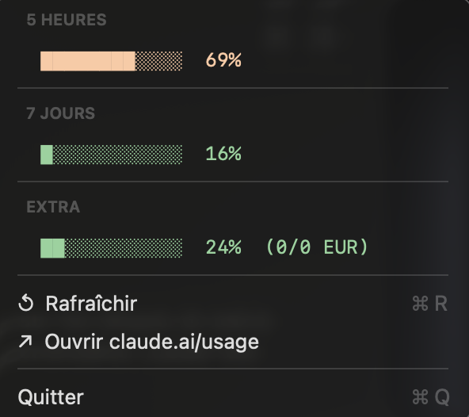

# Claude Usage Widget

Track your Claude usage (5h / 7d / extra credits) in the macOS menu bar or Windows/Linux system tray.

<p align="center">
  
</p>

Two options depending on your setup:

| | macOS | Windows / Linux |
|---|---|---|
| **File** | `ClaudeUsage` + `claude-usage.5m.py` | `claude-tray.py` |
| **Look** | Native progress bars | Icon in system tray |
| **Requires** | Python 3.9+ | Python 3.9+ + pystray |

## How it works

No Anthropic API key needed. The scripts read your browser session cookies for `claude.ai` via [`browser-cookie3`](https://pypi.org/project/browser-cookie3/), then call the internal usage endpoint.

Browsers auto-detected: **Safari**, **Chrome**, **Firefox** (+ **Edge** on Windows).

> **Unofficial.** This is not a public Anthropic API. It may change or break at any time. Not affiliated with Anthropic.

## Prerequisites

- Python 3.9+
- Logged into [claude.ai](https://claude.ai) in any supported browser
- **macOS**: Full Disk Access granted to Terminal / the app running the script (*System Settings > Privacy & Security > Full Disk Access*)
- **Windows**: Chrome, Firefox or Edge with an active claude.ai session
- **Linux**: Chrome or Firefox with an active claude.ai session

## Install

```bash
pip3 install -r requirements.txt
```

### macOS — Native menu bar app (recommended)

1. Download `ClaudeUsage` and `claude-usage.5m.py`
2. Place both files in the same folder
3. Edit line 2 of `ClaudeUsage` paths if needed (default: `~/Documents/swift bar/`)
4. Run:
   ```bash
   chmod +x ClaudeUsage claude-usage.5m.py
   ./ClaudeUsage
   ```

> **Note:** The `ClaudeUsage` binary is compiled for Apple Silicon (arm64). Intel Mac users can use the SwiftBar option below.

### macOS — SwiftBar plugin (alternative)

1. Install [SwiftBar](https://github.com/swiftbar/SwiftBar).
2. Copy `claude-usage.5m.py` to your SwiftBar plugin folder.
3. `chmod +x claude-usage.5m.py`
4. Refresh SwiftBar.

### Windows / Linux — System tray

```bash
python3 claude-tray.py
```

## License

MIT — see [LICENSE](LICENSE).
